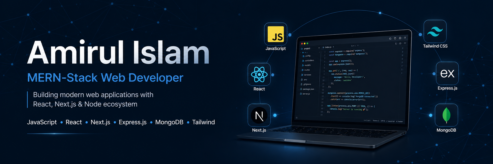

<!-- ===================== HEADER BANNER ===================== -->

  

---

# 👋 Hi, I'm Amirul Islam

### Full-Stack Web Developer (MERN + Next.js)

🌐 Portfolio: https://amirul-islam.vercel.app

## 📍 Location & Contact

📍 Sylhet, Bangladesh  
📧 amirulislam9.e@gmail.com

---

## 🧠 About Me

I am a Full-Stack Web Developer focused on building real-world projects and gaining deep practical experience in modern web development. I create responsive and scalable web applications using React and Next.js, and develop robust backend systems with Node.js and MongoDB.

My current focus is moving beyond learning into real project execution, improving system design, performance optimization, and production-level development practices. I actively build and refine full-stack applications to strengthen my problem-solving skills in real scenarios.

My goal is to grow through hands-on experience, collaborate with developers, and reach a professional level where I can contribute to impactful and scalable products.

---

## 🔥 Current Focus

- Exploring advanced Next.js concepts and performance optimization
- Working on SportNest — a real-world sports facility booking system with full-stack architecture
- Building a full-featured tourism booking platform
- Improving backend architecture using Node.js and Express
- Working on real-world full-stack projects for portfolio growth

---

## 🛠️ Skills

  

---

## 🌐 Connect With Me

- LinkedIn: https://linkedin.com/in/amirulislamdev
- GitHub: https://github.com/AMIRUL1104
- facebook: https://www.facebook.com/amirul.dev
- instagram: https://www.instagram.com/amirul.dev

---

## 📊 GitHub Stats

  

  

<!-- # 📊 GitHub Stats:

 
 

 -->

---

## 🚀 Featured Projects

### 1. Tourism Booking Platform

A full-stack web application built with React, Next.js, Node.js, and MongoDB. Includes authentication, booking system, and admin dashboard.

### 2. Modern UI Dashboard

Responsive admin dashboard built with React and Tailwind CSS focusing on clean UI and performance.

### 3. REST API Backend System

Secure and scalable backend system using Node.js, Express.js, and MongoDB with authentication and CRUD operations.

---

## 🏆 GitHub Trophies

### ✍️ Random Dev Quote

---

## 🎯 Developer Mindset

- Build real-world production-level applications
- Focus on clean UI + scalable backend architecture
- Continuous learning through hands-on projects
- Performance and usability first approach

---

  🚀 Building scalable full-stack applications | Clean UI • Strong Backend • Real Projects

